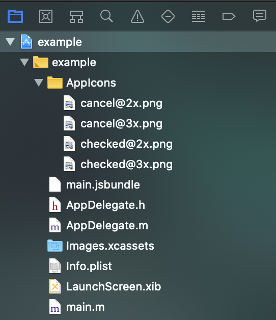
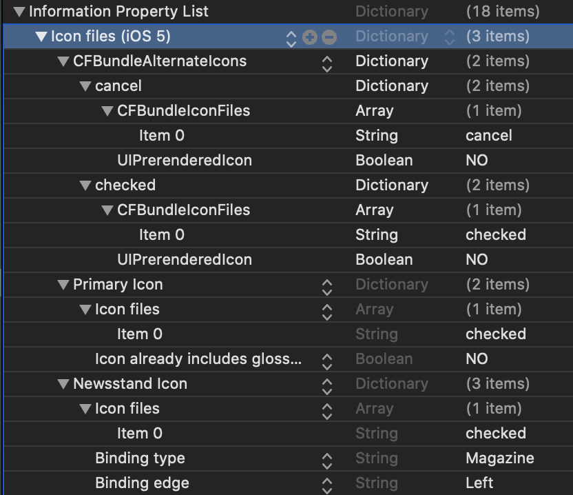

# React Native Change Icon

Change Application Icon Programmatically.
- [x] iOS
- [ ] Android

## Getting started

`$ yarn add install react-native-change-icon`

### Mostly automatic installation (Recommended)

`$ react-native link react-native-change-icon`

### Manual installation

#### iOS

1. In XCode, in the project navigator, right click `Libraries` ➜ `Add Files to [your project's name]`
2. Go to `node_modules` ➜ `react-native-change-icon` and add `RNChangeIcon.xcodeproj`
3. In XCode, in the project navigator, select your project. Add `libRNChangeIcon.a` to your project's `Build Phases` ➜ `Link Binary With Libraries`
4. Run your project (`Cmd+R`)<

#### Android (Currently Not Functional)

1. Open up `android/app/src/main/java/[...]/MainApplication.java`
  - Add `import com.reactlibrary.RNChangeIconPackage;` to the imports at the top of the file
  - Add `new RNChangeIconPackage()` to the list returned by the `getPackages()` method
2. Append the following lines to `android/settings.gradle`:
  	```
  	include ':react-native-change-icon'
  	project(':react-native-change-icon').projectDir = new File(rootProject.projectDir, 	'../node_modules/react-native-change-icon/android')
  	```
3. Insert the following lines inside the dependencies block in `android/app/build.gradle`:
  	```
      compile project(':react-native-change-icon')
  	```

## Usage

#### iOS

1. Open your project in Xcode and create an **App Icons** group inside you app's group.
2. Add all the app icons you need inside this group with names like *icon@2x.png*, *icon@3x.png*.
3. Your directory structure in Xcode would look like:



4. Open the **Info.plist** file.
5. Add *Icon files (iOS 5)* to the *Information Property List*.
6. Add *CFBundleAlternateIcons* as a dictionary to the *Icon files (iOS 5)*, it is used for alternative icons.
7. Add dictionaries under *CFBundleAlternateIcons* named as your icon names in **App Icons** group.
8. For each dictionary, two properties, *UIPrerenderedIcon* and *CFBundleIconFiles* need to be configured.
9. Set the type of *UIPrerenderedIcon* to *String* and its value to *NO*.
10. Set the type of *CFBundleIconFiles* to *Array* and set its first key, *Item 0*'s type to *String* and its value to the corresponding icon names.
11. After all these steps, your **Info.plist** file should look like:



Now you can use the following code to change application icon:

```javascript
import { changeIcon } from 'react-native-change-icon';

// Pass the name of icon as string to the "changeIcon" function
changeIcon('icon_name');
```
